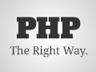
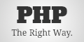
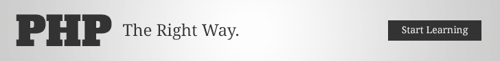
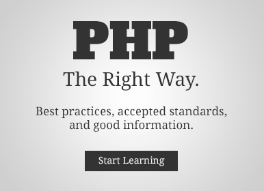
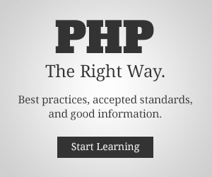
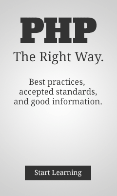

# بانرات ويب

قم بالنشر على الويب باستخدام صور  _PHP: بالطريقة الصحيحة_! قم بإخبار المطورين الطامحين لإيجاد معلومات مفيدة.

## ازرار 1 (120x90)





## ازرار 2 (120x60)





## متصدرة (728x90)





## مستطيل كبير (386x280)





## مستطيل متوسط (300x250)





## مستطيل (180x150)





## زر مربع (125x125)





## مستطيل طولي (240x400)




